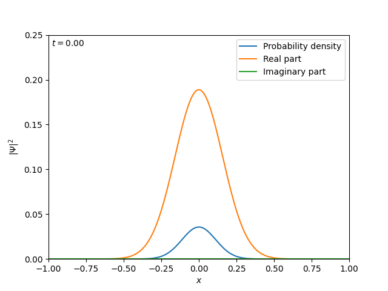
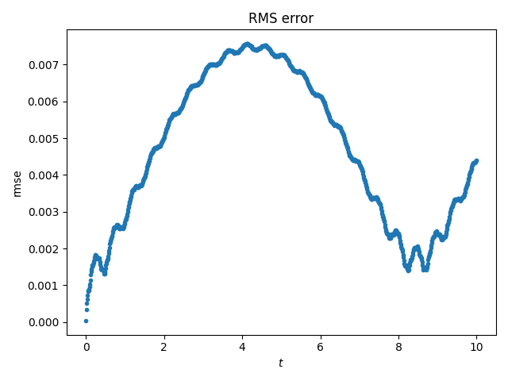

# Crank-Nicholson numerical simulation of Schroedinger's equation

The time-dependent Schroedinger equation is
```math
i\hbar \frac{\partial}{\partial t} \Psi(x,t) = \left( -\frac{\hbar^2}{2m} \frac{\partial ^2}{\partial x^2} + V(x) \right) \Psi(x,t).
```

The numerical and exact solutions to an infinite square potential well system with initial state $\Psi(x,0) = Ax(1-x)$ (where $A$ is a normalisation factor) and $\Delta x = \Delta t = 0.01$ are shown below, together with the first three eigenstates.
We see that the $n=1$ eigenstate dominates, since the magnitude of the eigenstates falls off proportionally to $n^2$ (see below).



Since the wavefunction $\Psi$ must be normalisable, $\Psi \to 0$ as $x \to \pm\infty$.
Therefore, we assume that the magnitude of $\Psi$ is negligible at the boundaries and impose zero Dirichlet boundary conditions.
For scattering states, the boundaries must be handled differently and this will be implemented in future.

## Error analysis
We use the exact solution as described below to calculate the root mean squared error (RMSE) for the numerical solution.
The RMSE is plotted as a function of time below.



We observe oscillatory behaviour with two different (ranges of) frequencies.
From the animation, we can see that the oscillations of the numerical and exact solutions are out of phase, giving rise to the the lower frequency oscillation in the RMSE.
A likely explanation for the higher frequency oscillations is artifacts of the Crank-Nicholson method.

# Technical details

## Crank-Nicholson
Let $\psi_j^n$ denote the numerical approximation to $\psi(x_j, t_n)$, where $x_j$ and $t_n$ are on a discretised grid with step sizes $\Delta x$ and $\Delta t$ respectively.
To approximate the partial derivatives, we use the forward difference in time and central difference in space, given by
```math
\frac{\partial\Psi(x,t)}{\partial t} \approx \frac{\Psi_j^{n+1} - \Psi_j^n}{\Delta t}, \qquad
\frac{\partial^2\Psi(x,t)}{\partial x^2} \approx \frac{\Psi_{j+1}^n - 2\Psi_j^n + \Psi_{j-1}^n}{\Delta x^2}.
```

For the Crank-Nicholson scheme, we take the average of the implicit and explicit central differences.
Substituting these into the Schroedinger equation gives us
```math
i\hbar \frac{\Psi_j^{n+1} - \Psi_j^n}{\Delta t}
    = -\frac{\hbar^2}{2m} \cdot \frac12 \left( \frac{\Psi_{j+1}^n - 2\Psi_j^n + \Psi_{j-1}^n}{\Delta x^2}
    + \frac{\Psi_{j+1}^{n+1} - 2\Psi_j^{n+1} + \Psi_{j-1}^{n+1}}{\Delta x^2} \right)
    + \frac12 V_j (\Psi_j^n + \Psi_j^{n+1}).
```

Rearranging, we get
```math
\begin{align*}
i\hbar \frac{\Psi_j^{n+1}}{\Delta t} + \frac{\hbar^2}{4m} \frac{\Psi_{j+1}^{n+1} - 2\Psi_j^{n+1} + \Psi_{j-1}^{n+1}}{\Delta x^2} - \frac12 V_j \Psi_j^{n+1}
  &= i\hbar \frac{\Psi_j^n}{\Delta t} -\frac{\hbar^2}{4m} \frac{\Psi_{j+1}^n - 2\Psi_j^n + \Psi_{j-1}^n}{\Delta x^2} + \frac12 V_j \Psi_j^n \\
\left( \frac{i\hbar}{\Delta t} - \frac{\hbar^2}{2m\Delta x^2} - \frac{V_j}{2} \right) \Psi_j^{n+1} + \frac{\hbar^2}{4m\Delta x^2} (\Psi_{j+1}^{n+1} + \Psi_{j-1}^{n+1})
  &= \left( \frac{i\hbar}{\Delta t} + \frac{\hbar^2}{2m\Delta x^2} + \frac{V_j}{2} \right) \Psi_j^n - \frac{\hbar^2}{4m\Delta x^2} (\Psi_{j+1}^n + \Psi_{j-1}^n).
\end{align*}
```

Define $\alpha = \hbar^2/4m\Delta x^2$, $\beta = i\hbar/\Delta t$.
We can then write this as the matrix equation $A\mathbf\Psi^{n+1} = B\mathbf\Psi^n$, with
```math
A = \begin{pmatrix}
    \beta - 2\alpha - V_0/2 & \alpha \\
    \alpha & \beta - 2\alpha - V_1/2 & \alpha \\
    & \ddots & \ddots & \ddots \\
    && \alpha & \beta - 2\alpha - V_I/2 \\
\end{pmatrix},
```
```math
B = \begin{pmatrix}
    \beta + 2\alpha + V_0/2 & -\alpha \\
    -\alpha & \beta + 2\alpha + V_1/2 & -\alpha \\
    & \ddots & \ddots & \ddots \\
    && -\alpha & \beta + 2\alpha + V_I/2 \\
\end{pmatrix}.
```

It can be shown using von Neumann stability analysis that the Crank-Nicholson method is unconditionally stable.

## Iteration
At each timestep, we update the state by solving the linear system for $\mathbf\Psi^{n+1}$.
To do this efficiently, we use LU decomposition to factor the tridiagonal matrix $A$.
This reduces the time complexity of solving the system at each iteration from $O(n^3)$ (for regular Gaussian elimination) to $O(n^2)$.

## Exact solution
The solution to the Schroedinger equation can be written as a superposition of the eigenstates of the infinite potential well:
```math
\Psi(x,t) = \sum_{n=1}^\infty c_n \sin(n\pi x)\, e^{-i n^2 \pi^2 t/2}.
```
(For simplicity's sake, we let $\hbar = 1$).
We find the coefficients $c_n$ from the initial condition by calculating the overlap integral at $t = 0$,
```math
c_n = \int_{-\infty}^\infty \Psi^*(x,0) \sin(n\pi x).
```

From Griffiths' Introduction to Quantum Mechanics 2nd ed., Example 2.2, the analytical solution for the coefficients is
```math
c_n = \begin{cases}
0, & \text{if } n \text{ is even,} \\
8\sqrt{15}/(n\pi)^3 & \text{if } n \text{ is odd.}
\end{cases}
```

We approximate this on our discretised grid by finding the sum
```math
c_n \approx \hat c_n = \sum_{j=0}^{N_x} \Psi^*(x_j,0) \sin(n\pi x_j),
```
where $N_x$ is the number of subintervals in the grid, and we approximate the exact solution $\Psi(x,t)$ by
```math
\Psi(x,t) \approx \sum_{n=1}^{n_\text{max}} \hat c_n \sin(n\pi x)\, e^{-i n^2 \pi^2 t/2}
```
for some $n_\text{max}$.
The above animation was plotted with $n_\text{max} = 5$.
