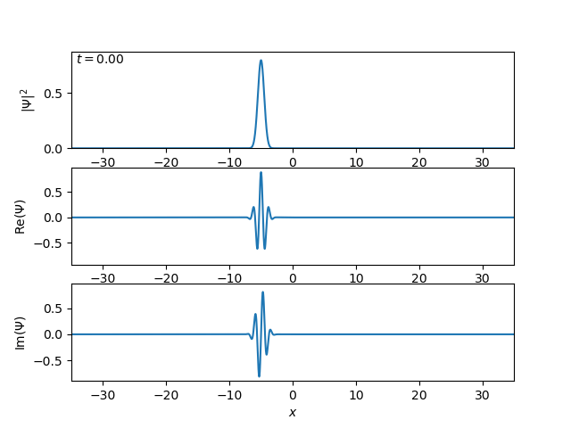
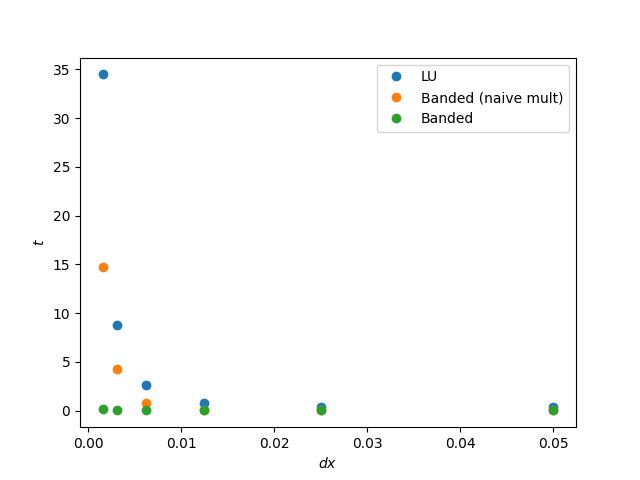
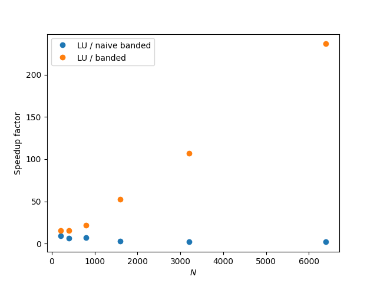
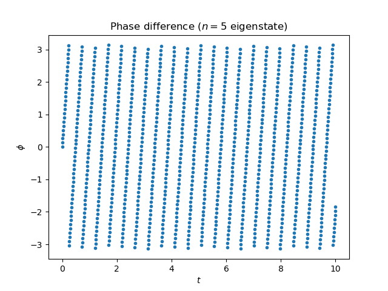

# Numerical simulation of Schroedinger's equation



*Gaussian wave packet scattering off a step potential.*

The time-dependent Schroedinger equation is
```math
i\hbar \frac{\partial}{\partial t} \Psi(x,t) = \left( -\frac{\hbar^2}{2m} \frac{\partial ^2}{\partial x^2} + V(x) \right) \Psi(x,t).
```

This project numerically solves the Schroedinger equation to simulate the evolution of a quantum wavefunction over time.

## Performance optimisation

At each timestep, we update the state $\mathbf\Psi^n$ by solving a linear system
```math
A\mathbf\Psi^{n+1} = B\mathbf\Psi^n,
```
where $A$ and $B$ are symmetric tridiagonal Toeplitz matrices.

To do this efficiently, I initially used LU decomposition.
This reduces the time complexity of solving the system at each iteration from $O(n^3)$ (for regular Gaussian elimination) to $O(n^2)$.
I then profiled `solver.cn_solve_lu` using `line_profiler`, which showed that the major bottlenecks were the linear solver and matrix multiplication.

| Line | % Time |
| - | - |
| `psi[1:-1,n+1] = lu_solve((lu, piv), b_psi)` | 49.6 |
| `b_psi = b @ psi[1:-1,n]` | 44.5 |
| Other | 5.9 |

Exploiting the tridiagonal (banded) structure of $A$ and $B$, I updated the solver to use the `scipy` banded matrix solver instead of LU decomposition.
Additionally, I replaced the naive matrix multiplication with a much-more efficient scalar multiplication of slices.



Interestingly, naive matrix multiplication appears to dominate the time complexity of the banded solver, so an $O(n^2)$ time complexity is clearly visible for both the LU and naive banded solvers.
Meanwhile, the fully optimised banded solver vastly outperforms both.

A speedup factor $S = t_L/t_\text{banded}$ was calculated to quantify the performance improvement.



| dx      | N    | LU time (s) | Banded naive (s) | Banded (s) | Speedup (naive) | Speedup (banded) |
| ------- | ---- | ----------- | ---------------- | ---------- | --------------- | ---------------- |
| 0.0500  | 201  | 0.352       | 0.0374           | 0.0224     | 9.42            | 15.71            |
| 0.0250  | 401  | 0.412       | 0.0601           | 0.0268     | 6.86            | 15.38            |
| 0.0125  | 801  | 0.763       | 0.1087           | 0.0354     | 7.02            | 21.59            |
| 0.00625 | 1601 | 2.62        | 0.786            | 0.0498     | 3.33            | 52.52            |
| 0.00313 | 3201 | 8.80        | 4.30             | 0.0822     | 2.05            | 107.15           |
| 0.00156 | 6401 | 34.48       | 14.75            | 0.1458     | 2.34            | 236.46           |

## Testing
To validate the results of the solver, I wrote automated tests for accuracy and norm conservation.
This compared the numerical and analytical results for eigenstates of an infinite potential well, checking that the PDFs were within tolerance of each other and the integral was conserved at 1 up to machine precision.

Interestingly, while the PDFs passed the tests, the numerical solution accumulated a phase error linearly with time.



## Implementation details (Crank-Nicholson discretisation)

Let $\psi_j^n$ denote the numerical approximation to $\psi(x_j, t_n)$, where $x_j$ and $t_n$ are on a discretised grid with step sizes $\Delta x$ and $\Delta t$ respectively.
To approximate the partial derivatives, we use the forward difference in time and central difference in space, given by
```math
\frac{\partial\Psi(x,t)}{\partial t} \approx \frac{\Psi_j^{n+1} - \Psi_j^n}{\Delta t}, \qquad
\frac{\partial^2\Psi(x,t)}{\partial x^2} \approx \frac{\Psi_{j+1}^n - 2\Psi_j^n + \Psi_{j-1}^n}{\Delta x^2}.
```

For the Crank-Nicholson scheme, we take the average of the implicit and explicit central differences.
Substituting these into the Schroedinger equation gives us
```math
i\hbar \frac{\Psi_j^{n+1} - \Psi_j^n}{\Delta t}
    = -\frac{\hbar^2}{2m} \cdot \frac12 \left( \frac{\Psi_{j+1}^n - 2\Psi_j^n + \Psi_{j-1}^n}{\Delta x^2}
    + \frac{\Psi_{j+1}^{n+1} - 2\Psi_j^{n+1} + \Psi_{j-1}^{n+1}}{\Delta x^2} \right)
    + \frac12 V_j (\Psi_j^n + \Psi_j^{n+1}).
```

This assumes that the magnitude of $\Psi$ is negligible at the boundaries; equivalent to zero Dirichlet boundary conditions.

Rearranging, we get
```math
\begin{align*}
i\hbar \frac{\Psi_j^{n+1}}{\Delta t} + \frac{\hbar^2}{4m} \frac{\Psi_{j+1}^{n+1} - 2\Psi_j^{n+1} + \Psi_{j-1}^{n+1}}{\Delta x^2} - \frac12 V_j \Psi_j^{n+1}
  &= i\hbar \frac{\Psi_j^n}{\Delta t} -\frac{\hbar^2}{4m} \frac{\Psi_{j+1}^n - 2\Psi_j^n + \Psi_{j-1}^n}{\Delta x^2} + \frac12 V_j \Psi_j^n \\
\left( \frac{i\hbar}{\Delta t} - \frac{\hbar^2}{2m\Delta x^2} - \frac{V_j}{2} \right) \Psi_j^{n+1} + \frac{\hbar^2}{4m\Delta x^2} (\Psi_{j+1}^{n+1} + \Psi_{j-1}^{n+1})
  &= \left( \frac{i\hbar}{\Delta t} + \frac{\hbar^2}{2m\Delta x^2} + \frac{V_j}{2} \right) \Psi_j^n - \frac{\hbar^2}{4m\Delta x^2} (\Psi_{j+1}^n + \Psi_{j-1}^n).
\end{align*}
```

Define $\alpha = \hbar^2/4m\Delta x^2$, $\beta = i\hbar/\Delta t$.
We can then write this as the matrix equation $A\mathbf\Psi^{n+1} = B\mathbf\Psi^n$, with
```math
A = \begin{pmatrix}
    \beta - 2\alpha - V_0/2 & \alpha \\
    \alpha & \beta - 2\alpha - V_1/2 & \alpha \\
    & \ddots & \ddots & \ddots \\
    && \alpha & \beta - 2\alpha - V_I/2 \\
\end{pmatrix},
```
```math
B = \begin{pmatrix}
    \beta + 2\alpha + V_0/2 & -\alpha \\
    -\alpha & \beta + 2\alpha + V_1/2 & -\alpha \\
    & \ddots & \ddots & \ddots \\
    && -\alpha & \beta + 2\alpha + V_I/2 \\
\end{pmatrix}.
```

It can be shown using von Neumann stability analysis that the Crank-Nicholson method is unconditionally stable.
